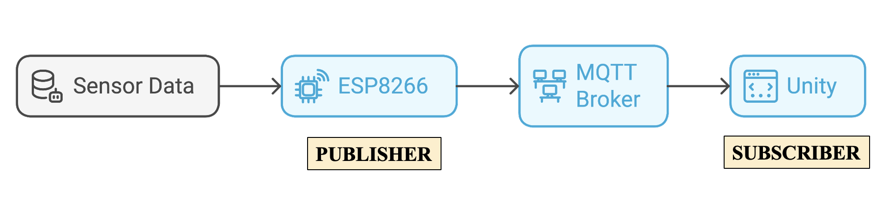
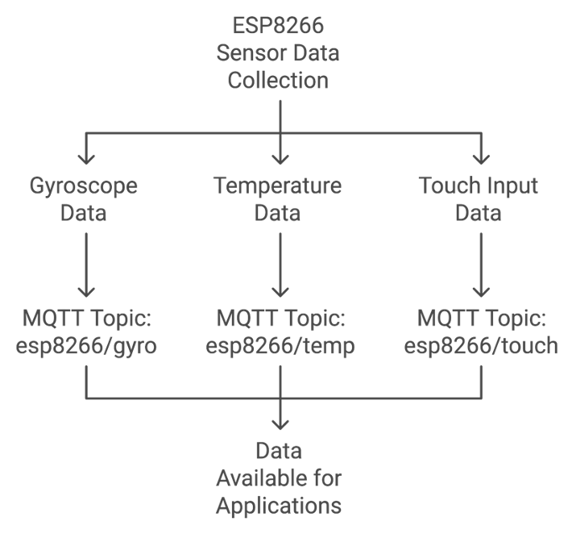

# Robotic Sensory System (RSS) Project

## Overview
This project implements a robotic sensory system using an ESP8266 microcontroller with multiple sensors for motion detection, object identification, sound detection, and touch sensing. The system captures movement data, detects nearby objects, responds to sound, and recognizes touch inputs, making it suitable for robotic navigation, motion tracking, and interactive applications.

## Video Demonstration
Watch the project in action

https://private-user-images.githubusercontent.com/61742806/428101034-368e9fab-e0e6-4092-aa44-a3eed2efd205.mp4?jwt=eyJhbGciOiJIUzI1NiIsInR5cCI6IkpXVCJ9.eyJpc3MiOiJnaXRodWIuY29tIiwiYXVkIjoicmF3LmdpdGh1YnVzZXJjb250ZW50LmNvbSIsImtleSI6ImtleTUiLCJleHAiOjE3NDMxNzg1MjksIm5iZiI6MTc0MzE3ODIyOSwicGF0aCI6Ii82MTc0MjgwNi80MjgxMDEwMzQtMzY4ZTlmYWItZTBlNi00MDkyLWFhNDQtYTNlZWQyZWZkMjA1Lm1wND9YLUFtei1BbGdvcml0aG09QVdTNC1ITUFDLVNIQTI1NiZYLUFtei1DcmVkZW50aWFsPUFLSUFWQ09EWUxTQTUzUFFLNFpBJTJGMjAyNTAzMjglMkZ1cy1lYXN0LTElMkZzMyUyRmF3czRfcmVxdWVzdCZYLUFtei1EYXRlPTIwMjUwMzI4VDE2MTAyOVomWC1BbXotRXhwaXJlcz0zMDAmWC1BbXotU2lnbmF0dXJlPWQ0OTU3YzM5OTcwOGY4NjVlZjliNTFlZmJiZTMyZWI3YjgwNWQyNjQxY2NhNWQzODMzZmEzMDlhYjFmNDJiYzkmWC1BbXotU2lnbmVkSGVhZGVycz1ob3N0In0.3kD29UMJpoLPAIkqaXjMfssmQ2twljbbY8jLxILKVrw

## System Architecture

### Sensor Assignment and Robot Control

### Data Flow Architecture

### ESP8266 Sensor Data Publishing

## Hardware Components
- ESP8266 microcontroller (NodeMCU or similar)
- MPU6050 accelerometer and gyroscope module
- IR sensor (connected to D5 pin)
- Sound sensor (for jump trigger functionality)
- Capacitive touch sensor (made from aluminum foil electrodes)
- Jumper wires
- Breadboard
- Power supply (USB or battery)

## Software Dependencies
- Arduino IDE
- Libraries:
  - Wire.h (for I2C communication)
  - Adafruit_MPU6050.h
  - Adafruit_Sensor.h
  - ezButton.h (for button functionality)

## Wiring Configuration
- MPU6050:
  - VCC → 3.3V
  - GND → GND
  - SCL → D1 (GPIO 5)
  - SDA → D2 (GPIO 4)
- IR Sensor:
  - VCC → 3.3V/5V
  - GND → GND
  - OUT → D5 (GPIO 14)
- Sound Sensor:
  - VCC → 3.3V/5V
  - GND → GND
  - OUT → Connected to ESP8266 input pin
- Capacitive Touch Sensor:
  - Two aluminum foil electrodes connected to ESP8266 touch-sensitive pins

## Functionality
The system performs four primary functions:
1. **Motion Tracking**: The MPU6050 sensor captures acceleration and rotation data on X, Y, and Z axes.
2. **Object Detection**: The IR sensor detects objects within its range (typically 2-30cm depending on the sensor model).
3. **Sound Detection**: The sound sensor triggers the robot's jump functionality when sound is detected.
4. **Touch Sensing**: The capacitive touch sensor made from aluminum foil electrodes detects when a finger touches the foil by measuring the increase in capacitance.

All sensor data is output through the serial monitor at 9600 baud rate, which can be monitored in real-time.

## Installation & Setup
1. Install the Arduino IDE and required libraries
2. Connect the hardware components according to the wiring configuration
3. Upload the code to your ESP8266 board
4. Open the Serial Monitor (9600 baud) to view sensor data

## Usage
Once setup is complete, the system will:
- Continuously report acceleration and gyroscope values from the MPU6050
- Detect and report when objects enter the IR sensor's detection range
- Trigger jump functionality when the sound sensor detects sound
- Detect touch inputs when a finger makes contact with the aluminum foil electrodes
- Output all data to the serial monitor

## Applications
- Robotic obstacle avoidance
- Motion-controlled interfaces
- Sound-activated triggers
- Touch-sensitive controls
- Position tracking
- Security systems
- Interactive installation art

## Troubleshooting
- If "Failed to find MPU6050 chip" error appears, check I2C connections
- Adjust the IR sensor sensitivity if detection is inconsistent
- Calibrate the sound sensor threshold for appropriate trigger sensitivity
- Ensure proper contact with aluminum foil electrodes for touch detection
- Verify proper power supply for stable sensor readings

## Future Enhancements
- Wireless data transmission
- Machine learning for motion pattern recognition
- Integration with actuators for automated responses
- Power optimization for battery operation
- Custom PCB design for more compact implementation
- Advanced gesture recognition using combined sensor data

## License
[Specify license information]

## Contributors
[List contributors if applicable] 
